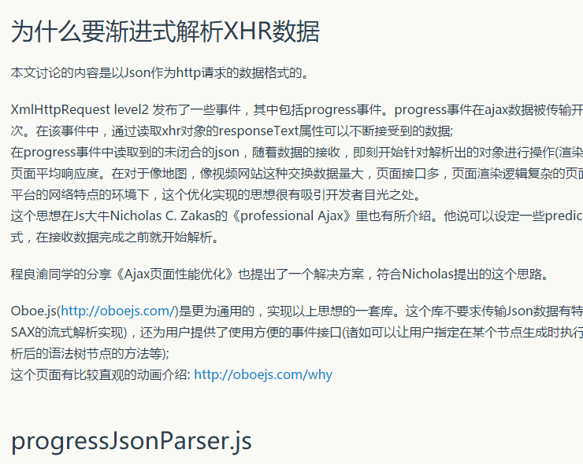

### ppt源码

```

<div class="reveal">
<div class="slides">
    <section data-background-image="img/zheng.jpg">
        <h1 id="tit1" style="position: absolute; top: 250px; left: 20px; background-image: linear-gradient(to left, green, silver ); color: #fff; font-size: 68px; font-weight: bold; padding: 10px; border-radius: 6px; box-shadow: 0 5px 10px rgba(0,0,0,0.22);0 5px 10px rgba(0,0,0,0.16);">一个前端程序员的书法之旅</h1>
        <a href="#" class="fragment hidden_atg" id="cover_1"></a>
    
    </section>

    <section data-markdown >
        <script type="text/template">
        ## 主要内容
        - 介绍我自己
        - 书协的旅程
        - 心得
        - 练习的展示
        </script>
    </section>

    <section data-markdown data-separator-vertical="---" >
        <script type="text/template" >
        ### 仓鹏
          - 小米移动运营商 前端工程师 
          - <a href="https://service.10046.mi.com" target="_blank">小米移动网厅</a>,小米移动客服系统, web主题编辑器
          - <a href="https://www.zybuluo.com/dustyface/note/58535">progressJsonParser</a>

          <p>
          
          
          </p>

        ---

        ## 工作经历
        - 艾德思奇、 爱奇艺、 去哪儿、小米 - 前端程序员 <!-- .element: class="fragment" data-fragment-index="1" -->
        - CSTC - 数据仓库组 <!-- .element: class="fragment" data-fragment-index="2" -->
        - 方正 - 测试、C++ Builder程序员 <!-- .element: class="fragment" data-fragment-index="3" -->
        <a href="#" class="fragment hidden_atg" id="work_exp_1"></a>
        <a href="#" class="fragment hidden_atg" id="work_exp_2"></a>
        <a href="#" class="fragment hidden_atg" id="work_exp_3"></a><a href="#" class="fragment hidden_atg" id="work_exp_4"></a><a href="#" class="fragment hidden_atg" id="work_exp_5"></a>

        </script>
    </section>


```